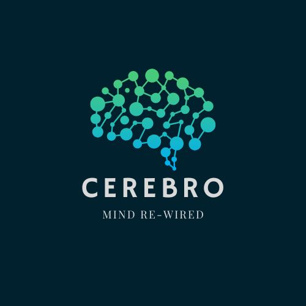

# CEREBRO - Clinic Partner App

<p align="center">
  
</p>

<p align="center">
  <strong>Mind Re-Wired</strong><br>
  A modern Flutter application for healthcare professionals to manage patient appointments
</p>

---

## Overview

**CEREBRO Clinic Partner** is a cross-platform mobile application built with Flutter, designed for doctors and healthcare professionals to efficiently manage their patient appointments. The app features a beautiful dark navy theme with teal/green accents inspired by neural network design.

### Key Features

- **Secure Authentication** - Email/mobile login, signup, and Google Sign-In
- **Appointment Dashboard** - View and manage all patient appointments
- **Real-time Status Updates** - Track scheduled, in-progress, and completed appointments
- **Video Consultations** - One-tap access to video call links
- **Patient Notes** - View and manage patient consultation notes
- **Demo Mode** - Built-in sample data for demonstrations
- **Modern UI** - Beautiful animations and micro-interactions

---

## Screenshots

The app features:
- Animated splash screen with the Cerebro brain logo
- Clean login/signup screens with gradient backgrounds
- Doctor registration for new users
- Appointment list with date grouping (Today, Tomorrow, etc.)
- Status badges and video call integration

---

## Tech Stack

| Technology | Purpose |
|------------|---------|
| **Flutter 3.x** | Cross-platform UI framework |
| **Dart** | Programming language |
| **Provider** | State management |
| **HTTP** | API communication |
| **Flutter Secure Storage** | Secure token storage |
| **Google Sign-In** | OAuth authentication |
| **URL Launcher** | External link handling |
| **Intl** | Date/time formatting |

---

## Project Structure

```
clinic_partner_app/
├── lib/
│   ├── main.dart                    # App entry point & theme
│   ├── core/
│   │   ├── constants/
│   │   │   ├── api_constants.dart   # API endpoints & config
│   │   │   └── app_config.dart      # App configuration (OAuth)
│   │   └── utils/
│   │       ├── api_client.dart      # HTTP client wrapper
│   │       └── micro_interactions.dart
│   ├── data/
│   │   ├── models/
│   │   │   ├── appointment_model.dart
│   │   │   ├── doctor_model.dart
│   │   │   └── user_model.dart
│   │   └── services/
│   │       ├── appointment_service.dart
│   │       └── auth_service.dart
│   └── presentation/
│       ├── providers/
│       │   ├── appointment_provider.dart
│       │   └── auth_provider.dart
│       ├── screens/
│       │   ├── splash_screen.dart
│       │   ├── login_screen.dart
│       │   ├── signup_screen.dart
│       │   ├── doctor_registration_screen.dart
│       │   └── doctor_home_screen.dart
│       └── widgets/
│           ├── appointment_card.dart
│           └── skeleton_loaders.dart
├── images/
│   └── cerebro.jpg                  # App logo
├── android/                         # Android platform files
├── ios/                             # iOS platform files
├── web/                             # Web platform files
└── pubspec.yaml                     # Dependencies
```

---

## Getting Started

### Prerequisites

- Flutter SDK 3.0.0 or higher
- Dart SDK
- Android Studio / VS Code with Flutter extensions
- Backend API server running (see backend documentation)

### Installation

1. **Clone the repository**
   ```bash
   git clone <repository-url>
   cd clinic-partner/clinic_partner_app
   ```

2. **Install dependencies**
   ```bash
   flutter pub get
   ```

3. **Configure API endpoint**
   
   Edit `lib/core/constants/api_constants.dart`:
   ```dart
   // For development
   static const String webDevBaseUrl = 'http://localhost:8000';
   
   // For Android emulator
   static const String devBaseUrl = 'http://10.0.2.2:8000';
   
   // For production
   static const String prodBaseUrl = 'https://your-api-domain.com';
   ```

4. **Configure Google Sign-In** (optional)
   
   Edit `lib/core/constants/app_config.dart`:
   ```dart
   static const String googleWebClientId = 
       'YOUR_GOOGLE_CLIENT_ID.apps.googleusercontent.com';
   ```

5. **Run the app**
   ```bash
   # For Android
   flutter run
   
   # For iOS
   flutter run -d ios
   
   # For Web
   flutter run -d chrome
   ```

---

## Configuration

### Environment Setup

The app supports multiple environments configured in `api_constants.dart`:

```dart
static const bool isProduction = false;  // Toggle for production

static String get baseUrl => isProduction ? prodBaseUrl : webDevBaseUrl;
```

### Google OAuth Setup

1. Go to [Google Cloud Console](https://console.cloud.google.com)
2. Create or select a project
3. Navigate to **APIs & Services → Credentials**
4. Create **OAuth 2.0 Client ID** (Web application)
5. Add authorized JavaScript origins and redirect URIs
6. Copy the Client ID to `app_config.dart`

For Android, add your SHA-1 fingerprint to the OAuth client.

---

## Demo Mode

The app includes a built-in demo mode for presentations:

1. Log in to the app (or use any test credentials)
2. On the Doctor Home Screen, tap the **flask icon** (🧪) in the app bar
3. Sample appointments will load instantly
4. A "DEMO" badge appears next to the title
5. Tap the flask icon again to exit demo mode

### Demo Data Includes:
- 10 sample appointments across multiple days
- Various statuses (Scheduled, In Progress)
- Video call links
- Patient notes
- Realistic patient names and details

---

## API Endpoints

The app communicates with the following backend endpoints:

### Authentication
| Method | Endpoint | Description |
|--------|----------|-------------|
| POST | `/api/auth/signup/` | Register new user |
| POST | `/api/auth/login/` | Login with credentials |
| POST | `/api/auth/google/` | Google OAuth login |
| GET | `/api/auth/me/` | Get current user |
| POST | `/api/auth/token/refresh/` | Refresh JWT token |
| POST | `/api/auth/register-doctor/` | Register as doctor |
| GET | `/api/auth/clinics/` | List available clinics |

### Appointments
| Method | Endpoint | Description |
|--------|----------|-------------|
| GET | `/api/appointments/` | List all appointments |
| GET | `/api/appointments/{id}/` | Get appointment details |
| PATCH | `/api/appointments/{id}/` | Update appointment |

---

## Theming

The app uses a custom color scheme inspired by the Cerebro logo:

```dart
// Primary Colors
const darkNavy = Color(0xFF0F2A3D);      // Background
const primaryTeal = Color(0xFF00B8A9);   // Primary accent
const secondaryGreen = Color(0xFF6FCF4E); // Secondary accent

// Gradient (for backgrounds)
colors: [
  Color(0xFF153A4D),  // Top
  Color(0xFF0F2A3D),  // Middle
  Color(0xFF0A2533),  // Bottom
]
```

---

## State Management

The app uses **Provider** for state management with two main providers:

### AuthProvider
- Manages user authentication state
- Handles login, signup, logout
- Stores user and doctor information
- Manages JWT token refresh

### AppointmentProvider
- Fetches and caches appointments
- Provides filtering (by status, date)
- Handles appointment status updates
- Includes demo mode functionality

---

## Building for Production

### Android APK
```bash
flutter build apk --release
```

### Android App Bundle
```bash
flutter build appbundle --release
```

### iOS
```bash
flutter build ios --release
```

### Web
```bash
flutter build web --release
```

---

## Troubleshooting

### Common Issues

1. **Network Error on Android Emulator**
   - Use `10.0.2.2` instead of `localhost` for the API URL

2. **Google Sign-In not working**
   - Verify OAuth Client ID is correct
   - Check SHA-1 fingerprint for Android
   - Ensure authorized origins are configured

3. **Token expired errors**
   - The app automatically refreshes tokens
   - If issues persist, logout and login again

4. **Appointments not loading**
   - Check API server is running
   - Verify the user is registered as a doctor
   - Use Demo Mode to test UI without backend

---

## Contributing

1. Fork the repository
2. Create a feature branch (`git checkout -b feature/amazing-feature`)
3. Commit your changes (`git commit -m 'Add amazing feature'`)
4. Push to the branch (`git push origin feature/amazing-feature`)
5. Open a Pull Request

---

## License

This project is proprietary software. All rights reserved.

---

## Contact

**CEREBRO - Mind Re-Wired**

For support or inquiries, contact the development team.

---

<p align="center">
  Built with Flutter 💙
</p>
